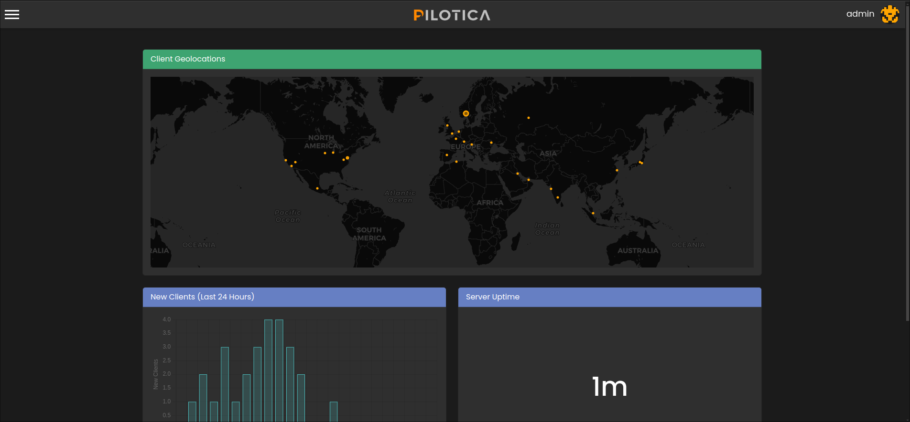

<h1 align="center">
  <br>
  
  <br>
</h1>

<h4 align="center">A post exploitation framework build on <a href="https://sanic.dev">Sanic</a>.<br>Developed for the sake of learning about post exploitation and red-teaming.</h4>

<p align="center">
  <a href="https://opensource.org/licenses/Apache-2.0"></a>
</p>

<p align="center">
  <a href="#-key-features">Key Features</a> •
  <a href="#-installation">Installation</a> •
  <a href="#-terminology">Terminology</a> •
  <a href="#-how-to-use">How To Use</a> •
  <a href="#-pcpkgs">PCPKGS</a> •
  <a href="#-service-api">Service-API</a> •
  <a href="#-license">License</a>
</p>

<p align="center">
    
</p>

## 📊 Key Features
* Add multiple users with premissions
* Client geolocation map
* Client task system
* Write you own clients using the ClientAPI

## 🔥 Setup the server

The setup process is very easy!
Just clone the repository, install all requirements and run Pilotica!

```bash
# Using git to clone the repo
$ git clone https://github.com/iinsertNameHere/Pilotica.git

# Go into the repository folder
$ cd Pilotica

# Install all Python requirements
$ pip install -r requirements.txt

# Run Pilotica
$ ./run.sh
```

### License

>This Project is Licensed under the terms of [Apache-2.0 license](LICENCE)!
